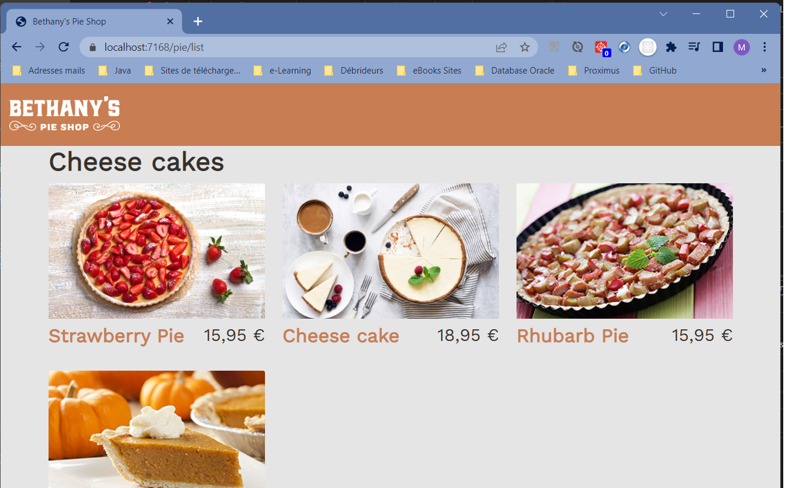
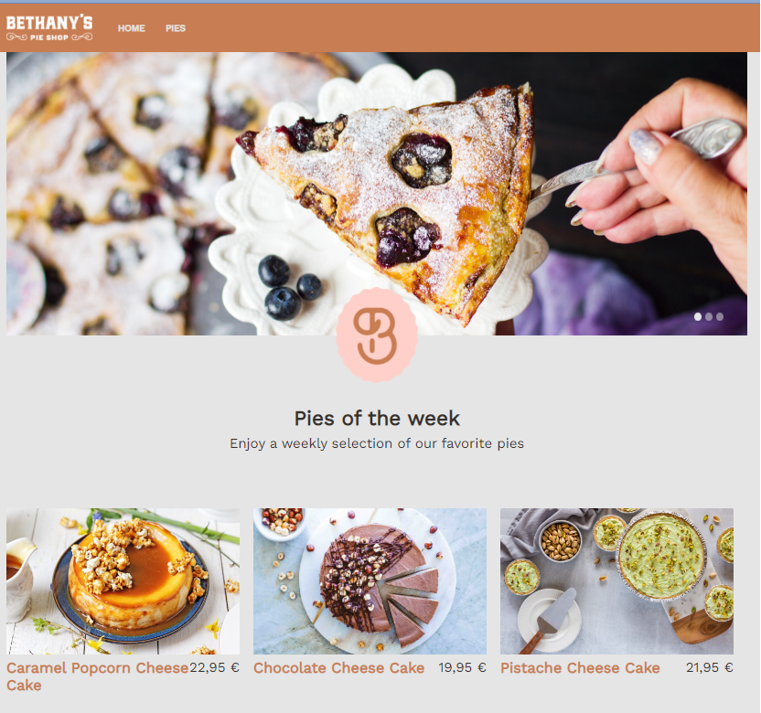
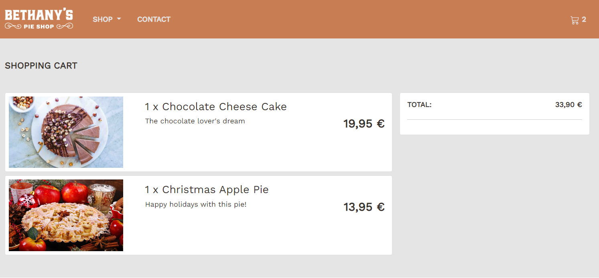

# BethanyPieShop
BethanyPieShop is a project to build an online store with ASP.NET Core 6, Razor pages, Blazor, Unit Testing, Entity Framework Core 6, and Web APIs.

# First Step
We begin by creating an empty ASP.NET Core MVC project. 

# Second Step
We create some folders to implement the MVC design pattern:
- Models folder: for model classes
- Views folder: for views files
- ViewModels folder: for model matching with views data displaying
- Controllers folder: for controller classes
- wwwroot folder: for static elements such like CSS, JavaScript, or images files

Two mocks repositories, MockPieRepository and MockCategoryRepository, were added for testing the web application. 
At that point, we only got a static web site which can be illustrated by the following image:

# Third Step

After successfully creating the static web site, our goal is to build the landing page. 
- Firstly, we seed the database by seeding a list of pies when the web application is launched. 
- Secondly, we create the landing page of the Bethany's Shop site.
- Thirdly, we add a carousel to slide pies in the wecome page of the web site and we add routing and navigation. Here is the image illustrating the resulting page:

# Fourth Step

- To make the web site look like an e-commerce site, we need to think of a cart. Thus, we create a shopping cart.
- Finally, we create the cart view to manage ordering from the client.

- We enable session management to keep client active when navigating for ordering pies

