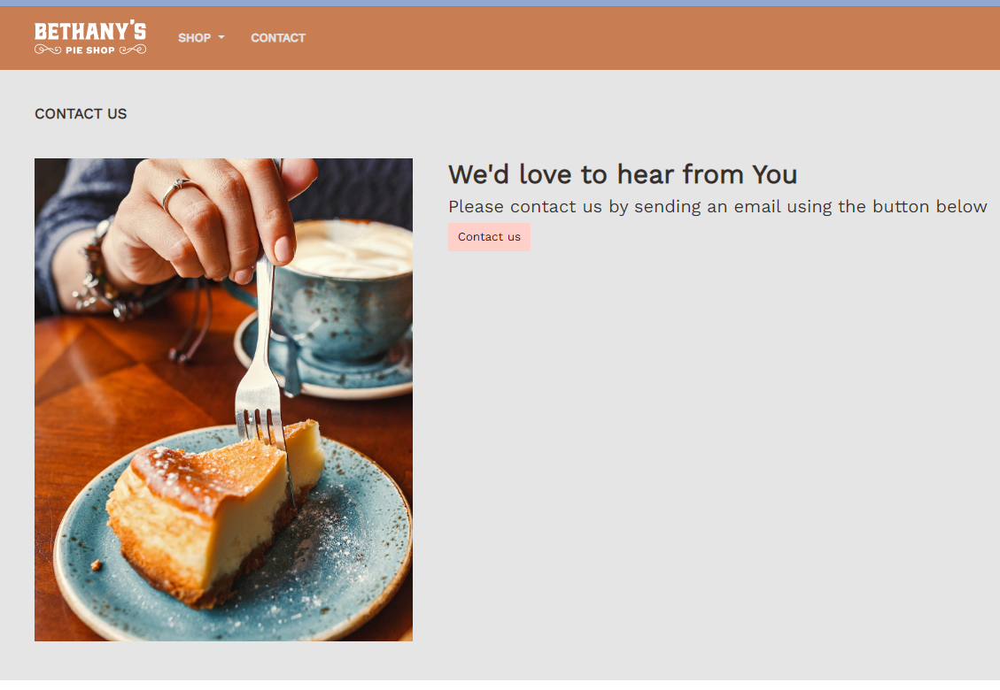

# BethanyPieShop
BethanyPieShop is a project to build an online store with ASP.NET Core 6, Razor pages, Blazor, Unit Testing, Entity Framework Core 6, and Web APIs.

# First Step : Creating an empty project
We begin by creating an empty ASP.NET Core MVC project. 

# Second Step : Adding folders for models, controllers, and views
We create some folders to implement the MVC design pattern:
- Models folder: for model classes
- Views folder: for views files
- ViewModels folder: for model matching with views data displaying
- Controllers folder: for controller classes
- wwwroot folder: for static elements such like CSS, JavaScript, or images files

Two mocks repositories, MockPieRepository and MockCategoryRepository, were added for testing the web application. 
At that point, we only got a static web site which can be illustrated by the following image:

# Third Step : Seeding initial database with Entity Framework and using Bootstrap 5
After successfully creating the static web site, our goal is to build the landing page. 
- Firstly, we seed the database by seeding a list of pies when the web application is launched. 
- Secondly, we create the landing page of the Bethany's Shop site.
- Thirdly, we add a carousel to slide pies in the wecome page of the web site and we add routing and navigation. Here is the image illustrating the resulting page:

# Fourth Step : Using ViewCompontnets and TagHelpers
- To make our web site to look like a basic e-Shop, we have chosen to allow pies to be display according their categories. For that purpose, we added the Shop item in the landing page to choose pies. 

- A client must have the possibility to contact the Bethany's shop for one reason or another. A contact page was then added to fullfill the goal.

- One feature of an e-commerce site is the possibility to use an shopping cart for choosing pies, we need to think of a cart. Then, we create the cart view to manage ordering from the client (by using ViewComponent).

- Finally, we enable session management to keep client active when navigating when ordering pies.

# Fifth Step: Using form for model binding, validation, and ordering
- Having the shopping cart, the goal of this step is to add support for order creation 
- The client must have the ability to create an order form and also to navigate to the order form
- We change the checkout page to create an order form:

- Then, for creating an order, we land on the order form page: 

- We never forget the validation from the two sides, the client side and the server side:

# Sixth Step: Adding unit tests to the application development
- In this, we choose to focus on units testing components of the web application we are building.
- We will use units testing. Specially, we will focus on controller and TagHelpers.
- We begin by creating an empty testing project.
- Then We write tests for PieController and EmailTagHelper. The following image can illustrate our testing resqults:

# Seventh Step: Adding a search page on the web site
- At this step, our goal is to add a searching page to help client find pies using some items.
- 

