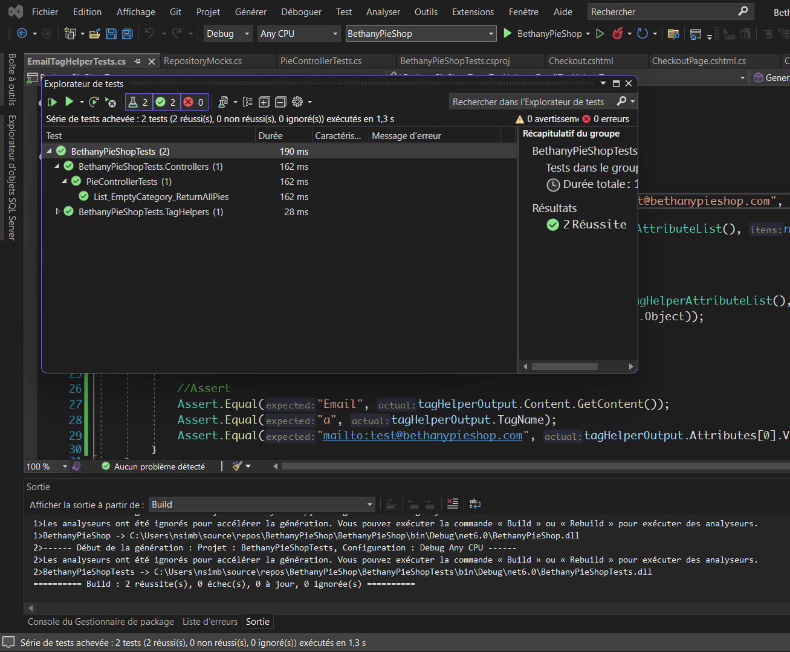
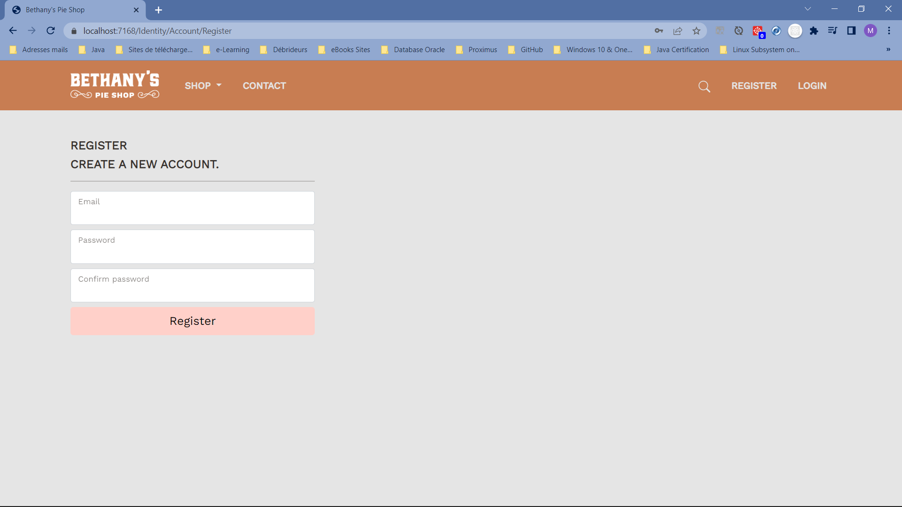

# Bethany's Pie Shop - An e-commerce web site for online pies selling 
This repository contains the source code of the Bethany's Pie Shop. The Bethany's Pies Shop is based on an ASP.NET Core course taken from pluralsight by Gill Cleeren. 
BethanyPieShop is a project to build an online store with ASP.NET Core 6, Razor pages, Blazor, Unit Testing, Entity Framework Core 6, and Web APIs.

## First Step : Creating an empty project
We begin by creating an empty ASP.NET Core MVC project. 

## Second Step : Adding folders for models, controllers, and views
We create some folders to implement the MVC design pattern:
- Models folder: for model classes
- Views folder: for views files
- ViewModels folder: for model matching with views data displaying
- Controllers folder: for controller classes
- wwwroot folder: for static elements such like CSS, JavaScript, or images files

Two mocks repositories, MockPieRepository and MockCategoryRepository, were added for testing the web application. 
At that point, we only got a static web site which can be illustrated by the following image:

## Third Step : Seeding initial database with Entity Framework and using Bootstrap 5
After successfully creating the static web site, our goal is to build the landing page. 
- Firstly, we seed the database by seeding a list of pies when the web application is launched. 
- Secondly, we create the landing page of the Bethany's Shop site.
- Thirdly, we add a carousel to slide pies in the wecome page of the web site and we add routing and navigation. Here is the image illustrating the resulting page:

## Fourth Step : Using ViewCompontnets and TagHelpers
- To make our web site to look like a basic e-Shop, we have chosen to allow pies to be display according their categories. For that purpose, we added the Shop item in the landing page to choose pies. 

- A client must have the possibility to contact the Bethany's shop for one reason or another. A contact page was then added to fullfill the goal.
- We begin by creating a searching REST API

- One feature of an e-commerce site is the possibility to use an shopping cart for choosing pies, we need to think of a cart. Then, we create the cart view to manage ordering from the client (by using ViewComponent).

- Finally, we enable session management to keep client active when navigating when ordering pies.

## Fifth Step: Using form for model binding, validation, and ordering
- Having the shopping cart, the goal of this step is to add support for order creation 
- The client must have the ability to create an order form and also to navigate to the order form
- We change the checkout page to create an order form:

- Then, for creating an order, we land on the order form page: 

- We never forget the validation from the two sides, the client side and the server side:

## Sixth Step: Adding unit tests to the application development
- In this, we choose to focus on units testing components of the web application we are building.
- We will use units testing. Specially, we will focus on controller and TagHelpers.
- We begin by creating an empty testing project.
- Then We write tests for PieController and EmailTagHelper. The following image can illustrate our testing resqults:

## Seventh Step: Adding a search page on the web site
- At this step, our goal is to add a searching page to help client find pies using some items.
- In ASP.NET Core, it's possible to create a searching page using either Javascript, specially jQuery and AJAX, or Blazor.
- We first create the REST API for searching Pies
- Then we create the searching page using jQuery and AJAX. This image below shows how the web site looks like when using "apple" as a query string:

- The searching case can also be handeled by using Blazor. The following illustration shows how the searching page looks like when using Blazor:

## Eighth Step: Bringing authentication and authorization in the game
- The main goal in this step is adding the identity to the application. To do that, we first install install the ASP.NET Core Identity Nuget in the BethanyShop project.
- Next, we add the authentication to the application to allow the user to register:
 

- Finally, to avoid a non-authenticated user to order a pie, we add the authorization for checking out pies to order. A client must login before checking out:

## Nine Step: Adding a footer to the application
- We made a constat that there is no footer on the web application. So, we find it a good practice to add a footer 

